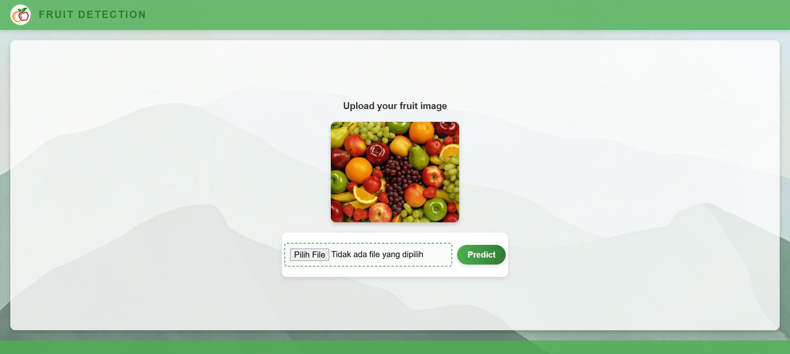

# Fruit Classification Web App

A Flask-based web application for classifying fruits as fresh or rotten using CNN model.

### Links
- [Datasets](https://developer.android.com/studio](https://developer.android.com/studio](https://www.kaggle.com/datasets/sriramr/fruits-fresh-and-rotten-for-classification/data)
- [Presentation](https://drive.google.com/file/d/1efWZClEn8f4Ok9t6Pw1T2YksWiMjefsA/view?usp=sharing)
- [Colab](https://colab.research.google.com/drive/1CnG7_sSmWcussVwObaEVxtyN9l4gJAUS?usp=sharing)

## Preview


## Features
1. Upload an image of a fruit through a simple web interface.
2. Classify fruits into the following categories:
   - Fresh Apples
   - Fresh Banana
   - Fresh Oranges
   - Rotten Apples
   - Rotten Banana
   - Rotten Oranges
3. Powered by a ResNet18 model fine-tuned with PyTorch.

## Install Dependencies
Run the following command to install required Python packages:
`pip install -r requirements.txt`

## Run the Application
1. Start the Flask Server `python app.py`
2. Access the Web Application `http://127.0.0.1:5000/`

## Endpoint
- **URL**: /predict
- **Method**: POST
- **Headers**
  - `Content-Type: Multipart/form-data`
  - `file` (file): The image file of the fruits.
- **Response**
  ```bash
  {
  "class": "Fresh Apples"
  }
  ```
